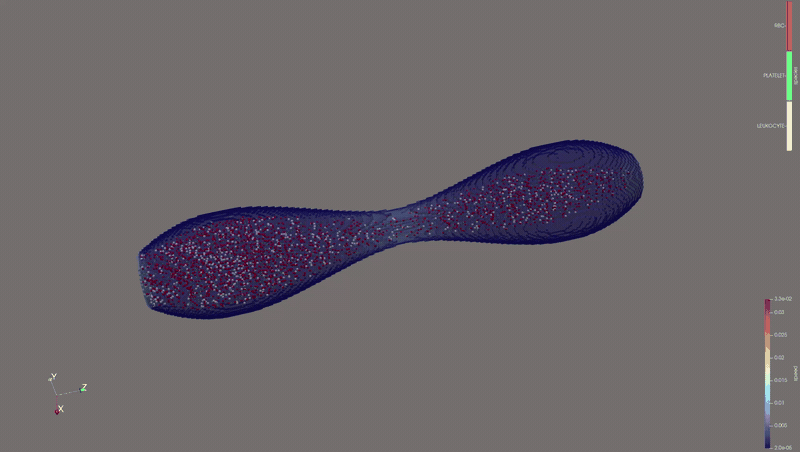
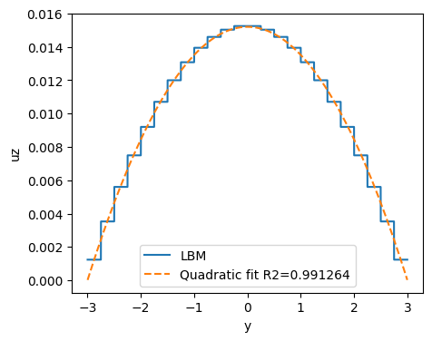
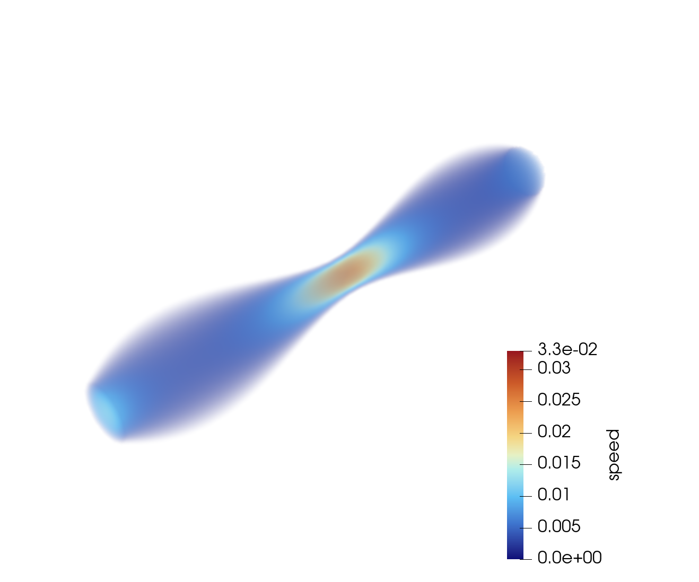

# CUDA vascular flow and blood-particle simulation

This project simulates flow through a three-dimensional vascular domain with a
CUDA implementation of the D3Q19 Lattice Boltzmann Method (LBM). An optional
particle model adds rigid red blood cells, platelets, and leukocytes, including
two-way drag coupling with the fluid and short-range contact forces.

The model is mesoscopic. It is intended to study flow and particle transport in
vessels that are larger than the represented particles. It is not a
cell-resolved biomechanical model and it does not model deformable membranes.



_The vessel surface is colored by speed; particle colors identify RBCs,
platelets, and leukocytes._

## What is implemented

- D3Q19 LBM with BGK collision, pull streaming, bounce-back walls, and Guo body
  forcing.
- Voxelized straight and stenotic vessel geometries.
- Zou-He and alternative outlet boundary implementations for comparison.
- Three rigid particle species stored in structure-of-arrays form on the GPU.
- Trilinear fluid-to-particle interpolation and equal-and-opposite drag reaction
  distributed back to the fluid.
- Linked-cell particle neighbor search over each voxel and its 26 neighbors.
- Spring-dashpot contact, tangential damping with a Coulomb cap, wall repulsion,
  and quaternion orientation updates.
- VTK output for ParaView, CSV diagnostics, CUDA kernel timing, and mesh-size
  benchmark scripts.

The default executable is fluid-only. Particle coupling starts only when
`--max-particles` is greater than zero.

## Results included with the project

The measurements below come from the completed project presentation. They are
reported as experimental results, not as general performance guarantees.

| Check | Observed result |
| --- | --- |
| Poiseuille profile | The simulated axial-velocity profile follows a quadratic fit with $R^2 = 0.991264$. |
| Outlet stability | Zou-He and the equilibrium-density outlet remain near a final mean density of $1.008$ in the reported warm-up sweep. Simple copy outlets drift substantially. |
| Mesh scaling | Throughput approaches roughly 49–50 MLUPS for the finest tested meshes. |
| Bandwidth estimate | The benchmark model approaches about 45 GB/s. This is an estimate based on bytes per cell-step, not a hardware-counter measurement. |
| Test hardware | NVIDIA GeForce RTX 2080 on an FAU `cip.pool` machine. |



The complete plots, experimental context, and interpretation are in
[Results](docs/RESULTS.md). The equations and modeling assumptions are in
[Model and mathematics](docs/MODEL_AND_MATHEMATICS.md).

## Build

### Requirements

- CMake 3.24 or newer, or GNU Make
- NVIDIA CUDA Toolkit with `nvcc`
- A CUDA-capable NVIDIA GPU
- A C++17-compatible host compiler

The default build targets CUDA compute capabilities 7.5, 8.0, and 8.6. Change
`CUDA_ARCHS` for the Makefile or `CMAKE_CUDA_ARCHITECTURES` for CMake if your GPU
uses another architecture.

Using the Makefile:

```bash
make build
```

Using CMake:

```bash
cmake -S . -B build-cuda -DCMAKE_BUILD_TYPE=Release
cmake --build build-cuda -j
```

The executable is written to `build-cuda/vascular_lbm` on Linux and macOS. A
multi-configuration Windows generator may place it in a configuration-specific
subdirectory.

## Run

The shortest fluid-only example uses the bundled straight vessel:

```bash
./build-cuda/vascular_lbm msh/voxel_domain.bin 200 20 0.8
```

Arguments are:

```text
vascular_lbm [mesh_file] [steps] [output_interval] [tau] [options]
```

| Positional argument | Default | Meaning |
| --- | ---: | --- |
| `mesh_file` | `msh/voxel_domain.bin` | Binary voxel domain |
| `steps` | `200` | Recorded steps after warm-up |
| `output_interval` | `20` | Interval for fluid and statistics output |
| `tau` | `0.8` | BGK relaxation time; it must be greater than `0.5` |

Run the stenotic domain with conservative particle rates:

```bash
./build-cuda/vascular_lbm \
  msh/cilindric_vessel_stenosis30_voxel_domain.bin \
  1000 100 0.8 \
  --warmup-steps 100 \
  --max-particles 10000 \
  --rbc-rate 0.01 \
  --platelet-rate 0.005 \
  --leukocyte-rate 0.005 \
  --particle-substeps 8
```

The top-level Makefile contains the parameters used by its convenience targets:

```bash
make run-fluid   # fluid-only baseline
make run         # particle-coupled configuration from Makefile
make print-args  # show the exact command without running it
```

### Main runtime options

Long options accept both `--option value` and `--option=value`.

| Option | Executable default | Purpose |
| --- | ---: | --- |
| `--warmup-steps N` | `0` | Advance the solver before recording output |
| `--outlet-kernel NAME` | `zhou_he` | Select `zhou_he`, `copy_all`, `copy_missing`, `equilibrium_rho1`, or `convective_soft` |
| `--performance-computation` | off | Time the main LBM CUDA kernels |
| `--max-particles N` | `0` | Allocate particle capacity; zero disables particles |
| `--rbc-rate X` | `1.0` | Average RBC injection attempts per LBM step |
| `--platelet-rate X` | `0.0` | Average platelet injection attempts per LBM step |
| `--leukocyte-rate X` | `0.0` | Average leukocyte injection attempts per LBM step |
| `--particle-output-interval N` | fluid interval | Set the particle VTK output interval |
| `--particle-substeps N` | `4` | Particle integration substeps per LBM step |
| `--contact-stiffness X` | `0.02` | Normal contact stiffness |
| `--contact-damping X` | `0.04` | Contact damping |
| `--friction X` | `0.2` | Coulomb-style tangential-force coefficient |
| `--wall-stiffness X` | `0.03` | Wall penalty stiffness |
| `--wall-damping X` | `0.04` | Wall penalty damping |
| `--max-particle-force X` | `0.02` | Per-particle force cap; zero disables it |
| `--max-particle-speed X` | `0.05` | Particle speed cap; zero disables it |

## Output and visualization

Each run creates an `output/` directory containing:

- `fluid_XXXXXX.vti`: density, speed, velocity, cell type, and finite-value
  diagnostics on the voxel grid.
- `particles_XXXXXX.vtp`: particle species, position, radius, velocity, force,
  orientation-related data, and contact count. These files appear only when
  particles are enabled.
- `lbm_stats.csv`: fluid and particle time-series diagnostics.
- `kernel_profile.csv`: per-kernel CUDA timings when performance measurement is
  enabled.

Open the VTI and VTP sequences in ParaView. Color the fluid by `speed` and the
particles by `species`. Species IDs are `0` for RBC, `1` for platelet, and `2`
for leukocyte.



## Mesh preprocessing

Ready-to-run voxel files are included. To regenerate them from a Gmsh `.geo`
file, install the optional Python dependencies:

```bash
python -m pip install gmsh trimesh numpy tqdm rtree
```

Then run, for example:

```bash
python scripts/voxelize_gmsh_geometry.py \
  --geo cilindric_vessel_stenosis30.geo \
  --dx 0.25 \
  --output msh/cilindric_vessel_stenosis30_voxel_domain.bin
```

The preprocessor uses Gmsh to generate and label the geometry, then uses
Trimesh to classify batches of voxel centers. The binary format stores grid
dimensions, spacing, origin, cell types, boundary normals, and inlet/outlet cell
lists.

## Repository map

```text
.
├── src/
│   ├── main.cu                  command line, loop, diagnostics, output
│   ├── lbm/                     D3Q19 fluid solver and CUDA kernels
│   ├── particles/               particle state, cell lists, integration
│   ├── forces/                  injection, drag, contact, wall forces
│   └── space/                   voxel-domain loading
├── msh/                         geometries and ready-to-run voxel domains
├── scripts/                     preprocessing, benchmark, and cluster tools
├── docs/                        theory, results, data, figures, and demo video
├── PARTICLE_SYSTEM.md           implementation-level particle notes
├── CMakeLists.txt
└── Makefile
```

## Model boundaries

These limitations matter when interpreting a result:

- Quantities are in lattice units unless explicitly converted outside the
  solver.
- RBC orientation and ellipsoidal axes are exported, but drag and contact use
  an effective spherical radius.
- Particles do not displace fluid volume and no particle surface is resolved.
- The active inlet treatment assumes a vessel aligned with the z axis.
- Wall contact uses the six face-adjacent solid voxels and has no lubrication or
  continuous collision detection.
- Particle slots are append-only during a run; exited slots are not reused.
- Brownian motion, deformable membranes, adhesion, lift, gravity, and buoyancy
  are not modeled.
- There is currently no automated test target.

See [Particle System](PARTICLE_SYSTEM.md) for implementation details, including
the nonstandard ordering used by the Verlet-inspired translational update.

## Utility scripts

All support scripts live in `scripts/`. They are separate from the CUDA solver
and can be run from the repository root.

| Script | What it does | Main output |
| --- | --- | --- |
| `voxelize_gmsh_geometry.py` | Converts one Gmsh `.geo` vessel into the custom voxel format using Gmsh and Trimesh. | A `*_voxel_domain.bin` file and an optional VTK mesh |
| `generate_mesh_resolution_sweep.py` | Runs the voxelizer for a list of decreasing `dx` values and records grid sizes and preprocessing times. | Generated meshes and `msh/dx_sweep/preprocess_summary.csv` |
| `benchmark_lbm_cuda.py` | Runs fluid-only CUDA benchmarks over one or more meshes. It can rebuild for several block sizes and optionally invoke Nsight Compute. | `output/cuda_benchmark_results.csv` and optional kernel/Nsight profiles |
| `plot_mesh_scaling_results.py` | Turns the benchmark CSV into the three mesh-scaling plots used in the results discussion. | `output/cuda_benchmark_vs_cells.png` |
| `shift_vtk_mesh_to_origin.py` | Shifts an ASCII VTK mesh so its minimum coordinate becomes `(0, 0, 0)`. | A sibling file ending in `_shifted.vtk` |
| `run_slurm_simulation.sh` | Requests one A40 GPU on a SLURM cluster, runs the Makefile configuration, and archives the generated output. | `simulation_output_<timestamp>.zip` |

Typical benchmark workflow:

```bash
python scripts/generate_mesh_resolution_sweep.py
python scripts/benchmark_lbm_cuda.py \
  --mesh-glob 'msh/dx_sweep/*_voxel_domain.bin' \
  --build \
  --block-size 256
python scripts/plot_mesh_scaling_results.py
```

Useful help commands:

```bash
python scripts/voxelize_gmsh_geometry.py --help
python scripts/generate_mesh_resolution_sweep.py --help
python scripts/benchmark_lbm_cuda.py --help
python scripts/plot_mesh_scaling_results.py --help
```

The VTK shift helper has one positional argument:

```bash
python scripts/shift_vtk_mesh_to_origin.py path/to/mesh.vtk
```

Submit the cluster workflow only on a SLURM system whose CUDA module and GPU
request match the script:

```bash
sbatch scripts/run_slurm_simulation.sh
```

Benchmark output depends on the GPU, CUDA version, selected block size, mesh,
warm-up, and I/O settings. Report those details whenever publishing new numbers.

## References and presentation

- [Final editable presentation](docs/HESP-Project-Presentation.pptx)
- [Model and mathematics](docs/MODEL_AND_MATHEMATICS.md)
- [Experimental results](docs/RESULTS.md)
- [References](docs/REFERENCES.md)

## License

No software license is currently included. The repository can be viewed and
evaluated, but reuse and redistribution require permission from the authors
until a license is added.
