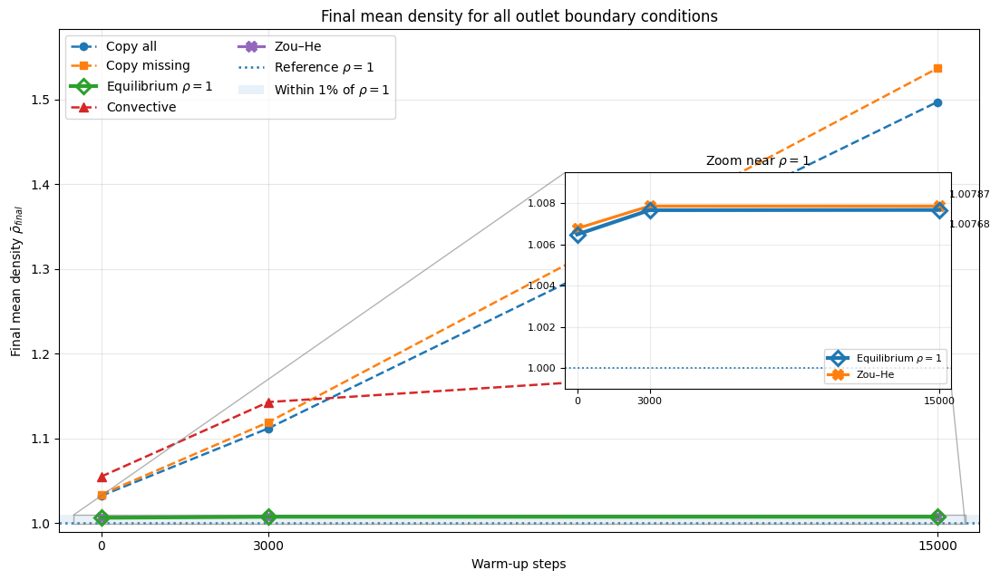
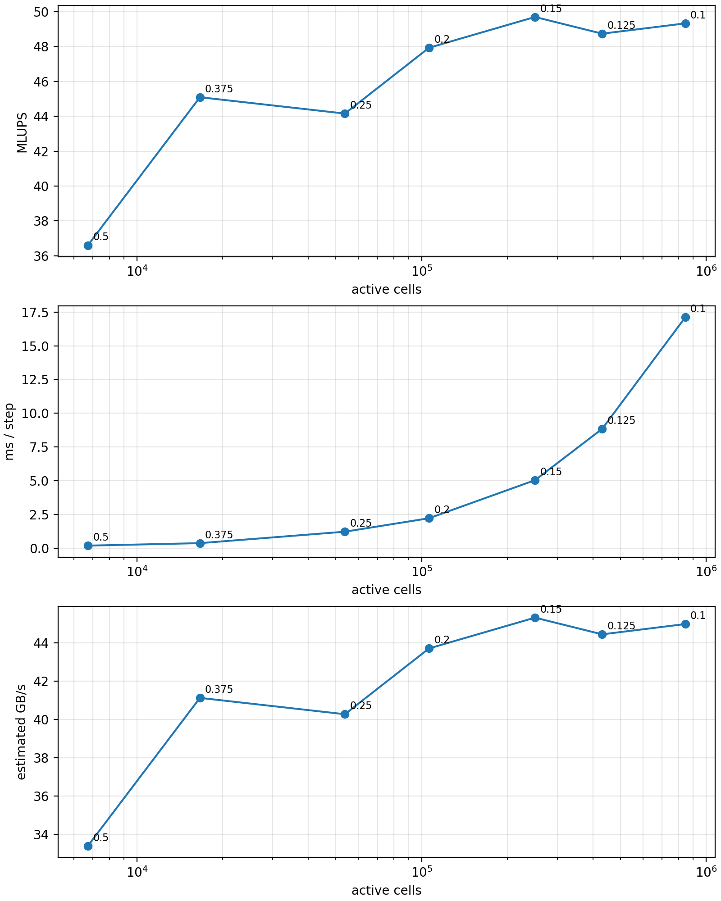
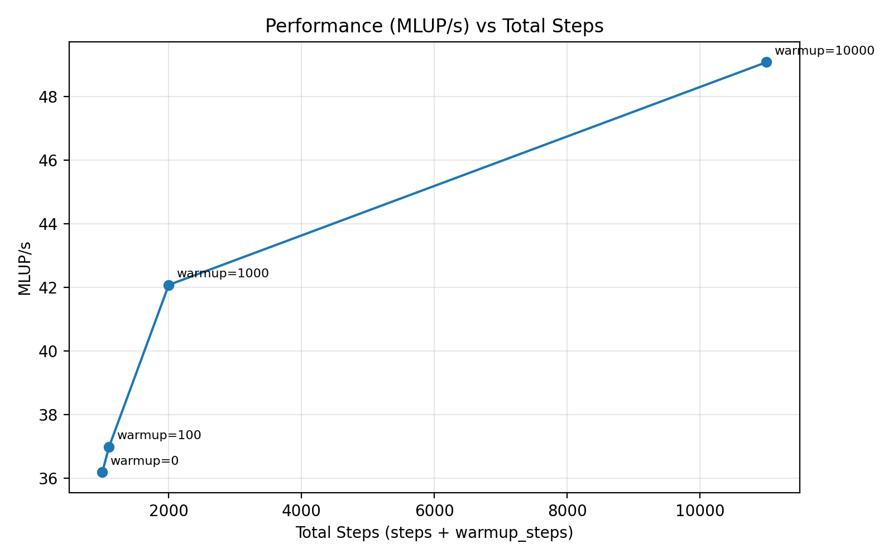
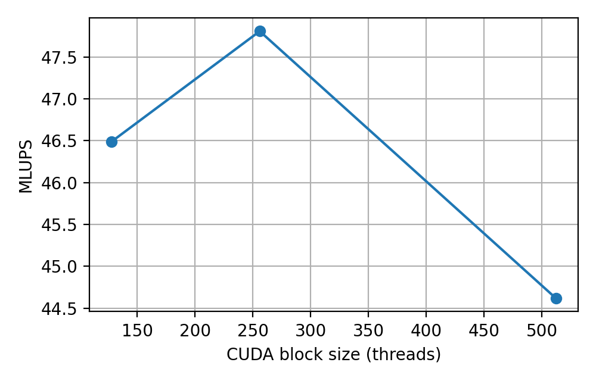
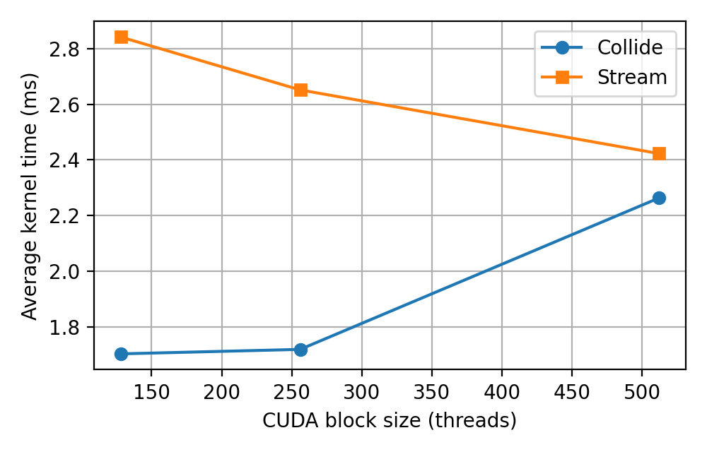

# Experimental results

This page records the results shown in the final project presentation. It keeps
the validation and performance claims separate from the model description so
the scope of each measurement remains clear.

## Test context

The presentation reports profiling on an FAU `cip.pool` computer with an NVIDIA
GeForce RTX 2080. The plots compare different mesh resolutions, warm-up lengths,
and CUDA block sizes. Results on other GPUs or with different output settings
will not be directly comparable.

The repository contains the scripts used for new measurements, but it does not
contain the complete raw dataset behind every presentation plot. The values
below are therefore reported at the precision visible in the supplied figures.
The retained [mesh preprocessing summary](data/mesh-preprocessing-summary.csv)
records the grid dimensions and active-cell counts for the resolution sweep.

## Outlet boundary comparison

Several outlet models were tested by tracking the final mean density after
different warm-up lengths.



The copy-all and copy-missing variants accumulate density as the warm-up grows;
at 15,000 warm-up steps their final mean density is about 1.50 and 1.54. The
soft-convective variant reaches about 1.19. In contrast, the equilibrium-density
and Zou-He variants remain close to the target $\rho=1$, near 1.008 in the
reported runs.

This comparison motivated the default `zhou_he` outlet. A final mean density
near one is useful evidence of stability for this case, but it does not by
itself prove that every local velocity or pressure field is accurate.

## Poiseuille-like velocity profile

For fully developed laminar flow in a straight circular vessel, the normalized
Poiseuille profile is

$$
\frac{u_z(r)}{u_{\max}}=1-\left(\frac{r}{R}\right)^2.
$$

The LBM cross-section follows the fitted quadratic closely:


The presentation reports $R^2=0.991264$ for the quadratic fit. Its normalized
Poiseuille RMSE settles near 0.01047 after 3,000 warm-up steps for both Zou-He
and the equilibrium-density outlet. This supports the expected parabolic trend
in the tested straight-vessel setup.

## Mesh-resolution scaling



Smaller voxel spacing increases the active-cell count and therefore the time per
step. Throughput improves with problem size and reaches a plateau near 49–50
MLUPS for the finest reported meshes. The estimated bandwidth follows the same
trend and approaches roughly 45 GB/s.

The bandwidth number is calculated by the benchmark script from an assumed
`912` bytes per active cell-step:

$$
B_{\mathrm{est}}=
\frac{912\,N_{\mathrm{active}}N_{\mathrm{steps}}}{t\,10^9}
\quad\text{GB/s}.
$$

It is not a direct DRAM counter reading. The plateau is consistent with a
memory-traffic limitation, but confirming that diagnosis requires hardware
counters, for example through Nsight Compute with counter access enabled.

## Warm-up and timing stability

The presentation also compares runs with 0, 100, 1,000, and 10,000 warm-up
steps while recording 1,000 measured steps.



Measured throughput rises from about 36 MLUPS without warm-up to about 49 MLUPS
with the longest warm-up. This is best interpreted as a timing-method effect:
fixed startup and output costs become a smaller fraction of a longer run. It
does not mean that adding warm-up steps makes the numerical kernels intrinsically
faster.

## CUDA block-size experiment



Among the three reported configurations, 256 threads per block produces the
highest overall throughput at about 47.8 MLUPS. The 128-thread run reaches about
46.5 MLUPS and the 512-thread run about 44.6 MLUPS.



Streaming time decreases across the tested block sizes, while collision time
increases sharply at 512 threads. The combined result explains why the largest
block does not deliver the best end-to-end throughput. This optimum is specific
to the tested GPU and build, so the Makefile keeps `BLOCK_SIZE` configurable.

## Stenotic-vessel output

The project writes fields and particles in VTK formats that ParaView can open as
time series.


The displayed case reaches its highest speed in the constricted section, as
expected when flow passes through a smaller cross-section. The image is a
qualitative visualization in lattice units, not a patient-specific prediction.

The animation below shows the three particle species moving through the same
stenotic geometry.


## Reproducing new measurements

Build with a chosen block size, then run the benchmark helper:

```bash
make -B build BLOCK_SIZE=256
python scripts/benchmark_lbm_cuda.py --help
```

For a mesh-resolution sweep:

```bash
python scripts/generate_mesh_resolution_sweep.py
python scripts/plot_mesh_scaling_results.py --help
```

When reporting a new benchmark, record at least the GPU model, CUDA version,
compiler flags, block size, mesh, active-cell count, number of warm-up and
measured steps, outlet kernel, and whether VTK output was enabled.
